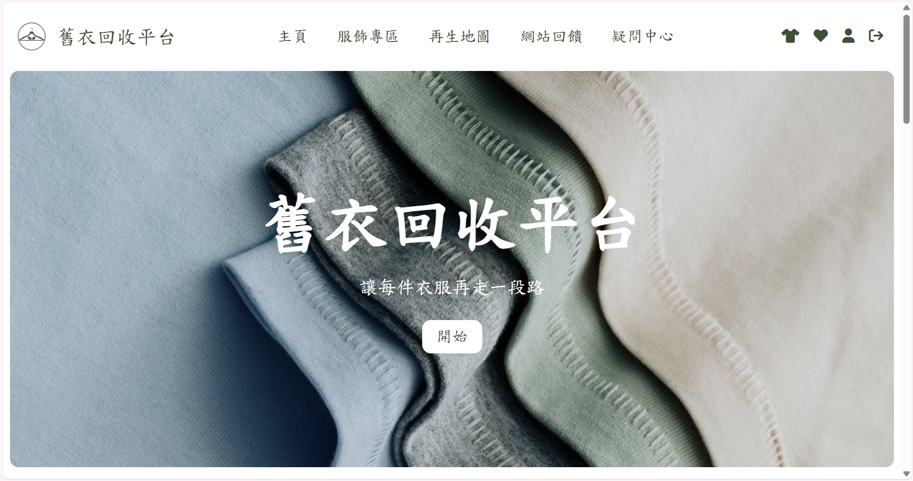

# 舊衣回收平台

一個具備「完整取衣申請流程 × 使用者系統 × 後台管理 × 數據分析」的網路平台，
模擬實際網站運作流程，並提供管理者進行物件與數據分析的功能。



## Demo 連結
https://cloth-reuse-wgmi.onrender.com/


## 核心功能

- 使用者註冊 / 登入
- 密碼加密儲存（bcrypt）
- Navbar 依登入狀態切換
- 服飾分類瀏覽
- 地點標記
- 顧客評論
- 管理者後台
    - 使用者管理
    - 資料管理
    - 數據監測

## 技術架構

### Frontend
- Vue 3
- Vue Router
- Chart.js
- Pinia

### Backend
- Flask
- SQLAlchemy

### Dev Tools
- concurrently（同時啟動前後端）


## 安裝與執行

### 1. Clone 專案
```bash
git clone https://github.com/Clare0808/cloth-reuse.git
cd cloth-reuse
```

### 2. 安裝套件

```bash
npm install
```

### 3. 環境需求

- Node.js
- npm
- Python
- SQLAlchemy

### 5. 啟動專案

```bash
npm run dev
```

若要分開啟動 (選擇性) :

#### 前端

```bash
npm run serve
```

#### 後端
```bash
cd backend
python app.py
```
